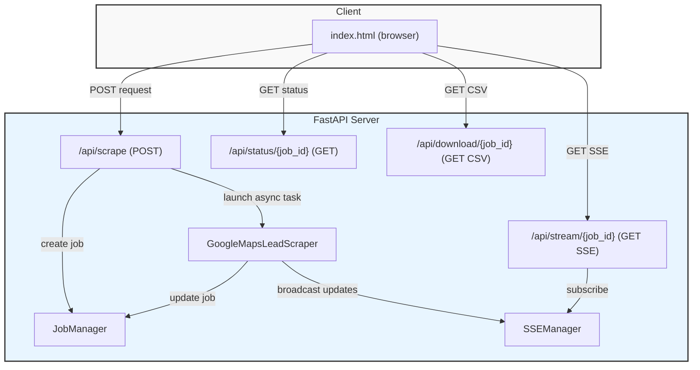
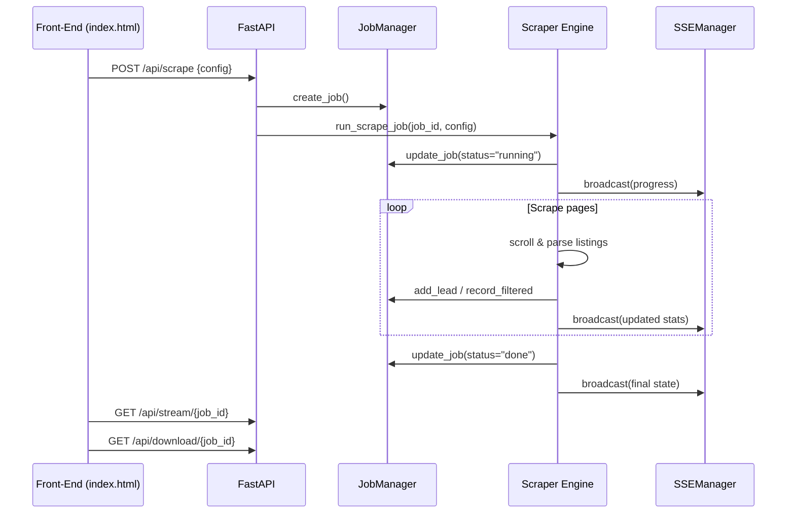

# 📁 Google Leads Scraper

> A fast, asynchronous **Google Maps lead scraper** built with **FastAPI**, **Playwright**, and **Server‑Sent Events** (SSE).  The repo contains a tiny front‑end (`index.html`) that talks to the API and streams live progress while scraping.

---

## 📖 Table of Contents
1. [Project Overview](#project-overview)
2. [Architecture Diagram](#architecture-diagram)
3. [Workflow Overview](#workflow-overview)
4. [Prerequisites](#prerequisites)
5. [Installation – Windows / Linux / macOS](#installation)
6. [Running the Server](#running-the-server)
7. [API Reference](#api-reference)
8. [Front‑End Usage](#front-end-usage)
9. [Exporting Results](#exporting-results)
10. [Common Commands Cheat‑Sheet (All OSes)](#common-commands-cheat-sheet)
11. [Troubleshooting & FAQ](#troubleshooting--faq)
12. [License](#license)

---

## 🏗️ Project Overview
The scraper works by:
- Accepting a **scrape request** via a FastAPI `POST /api/scrape` endpoint.
- Spawning an **asynchronous job** (`JobManager`) that tracks state, progress, and statistics.
- Launching a **headless Chromium instance** via **Playwright** to navigate Google Maps, scroll results, and extract lead data.
- Filtering leads based on user‑defined thresholds (rating, review count, website presence, phone number, etc.).
- Broadcasting live updates to any connected client through **SSE** (`/api/stream/{job_id}`).
- Persisting qualified leads and exposing a **CSV download** endpoint (`/api/download/{job_id}`).

All heavy lifting happens in `server.py`. The tiny UI (`index.html`) simply calls the API and renders the live status.

---

## 🧩 Architecture Diagram


---

## 🔄 Workflow Overview


---

## ⚙️ Prerequisites
| Item | Minimum Version | Install Guide |
|------|----------------|--------------|
| Python | 3.10+ | <details><summary>Windows</summary>`winget install Python.Python.3` or download from python.org</details> |
| pip | bundled with Python | `python -m ensurepip --upgrade` |
| Playwright browsers | bundled via `playwright install` | see **Installation** below |
| Git (optional for source control) | 2.30+ | `git --version` |

---

## 📦 Installation
Below are step‑by‑step commands for **Windows PowerShell**, **Linux (bash)**, and **macOS (zsh)**. Run them **inside the project folder** (`d:\Reddit Hackthon\Map`).

### 1️⃣ Clone the repo (if you haven't already)
```bash
# Windows PowerShell
git clone https://github.com/itxashancode/Google-Leads-Scraper.git
cd Google-Leads-Scraper

# Linux / macOS
git clone https://github.com/itxashancode/Google-Leads-Scraper.git
cd Google-Leads-Scraper
```

### 2️⃣ Create a virtual environment
```bash
# Windows PowerShell
python -m venv .venv
.\.venv\Scripts\Activate.ps1

# Linux / macOS
python3 -m venv .venv
source .venv/bin/activate
```

### 3️⃣ Install Python dependencies
```bash
pip install -r requirements.txt  # if a requirements.txt exists
# If not, install the core deps manually:
pip install fastapi uvicorn[standard] pydantic playwright aiofiles
```

### 4️⃣ Install Playwright browsers (required for headless Chromium)
```bash
# All platforms
playwright install chromium
```

### 5️⃣ (Optional) Install additional utilities
- **CSV viewer** – `pip install tabulate`
- **HTTP client** – `pip install httpie`

---

## 🚀 Running the Server
### Windows PowerShell
```powershell
# Activate venv if not already active
.\.venv\Scripts\Activate.ps1
# Start the FastAPI app
uvicorn server:app --host 0.0.0.0 --port 8000
```
### Linux / macOS
```bash
source .venv/bin/activate
uvicorn server:app --host 0.0.0.0 --port 8000
```
The console will display:
```
🚀 LeadHunt Server starting…
   API  → http://localhost:8000
   Open → index.html in your browser
```
Open `index.html` (double‑click or `open index.html` on macOS) in a browser and start scraping!

---

## 📡 API Reference
| Method | Endpoint | Description | Body / Params |
|--------|----------|-------------|---------------|
| **POST** | `/api/scrape` | Launch a new scrape job | `ScrapeRequest` JSON (see below) |
| **GET** | `/api/status/{job_id}` | Retrieve current job JSON | – |
| **GET** | `/api/stream/{job_id}` | SSE stream – live progress | – |
| **GET** | `/api/download/{job_id}` | Download qualified leads as `CSV` | – |

### `ScrapeRequest` model (default values shown)
```json
{
  "keyword": "plumber",
  "location": "Karachi",
  "min_rating": 4.0,
  "min_reviews": 5,
  "max_results": 50,
  "no_website_only": true,
  "require_phone": false
}
```
Adjust any field to suit your use‑case.

---

## 🖥️ Front‑End (`index.html`) Usage
1. Open `index.html` in a modern browser.
2. Fill the form (keyword, location, thresholds).
3. Click **Start Scrape** – the page calls `POST /api/scrape`.
4. A progress bar appears; live updates arrive via SSE.
5. When the job finishes, a **Download CSV** button becomes active.

The UI is pure HTML/JS – no build step required.

---

## 📂 Exporting Results
After the job reaches `status: "done"`:
```bash
# Using httpie (cross‑platform)
http GET http://localhost:8000/api/download/<job_id> -d > leads.csv
```
Or simply click the download button in the UI.

---

## 🛠️ Common Commands Cheat‑Sheet (All OSes)
| Action | Windows (PowerShell) | Linux / macOS (bash) |
|--------|----------------------|----------------------|
| **Create venv** | `.\.venv\Scripts\Activate.ps1` | `source .venv/bin/activate` |
| **Install deps** | `pip install -r requirements.txt` | same |
| **Install browsers** | `playwright install chromium` | same |
| **Run server** | `uvicorn server:app --host 0.0.0.0 --port 8000` | same |
| **Check job status** | `http GET http://localhost:8000/api/status/<job_id>` | same |
| **Download CSV** | `http GET http://localhost:8000/api/download/<job_id> -d > leads.csv` | same |
| **View logs** | `Get-Content .\uvicorn.log -Tail 20 -Wait` | `tail -f uvicorn.log` |
| **Stop server** | `Ctrl+C` | same |

---

## 🐞 Troubleshooting & FAQ
**Q: Playwright cannot find Chromium**
- Run `playwright install` again. Ensure the script has write permission to `%USERPROFILE%\.cache\ms-playwright` (Windows) or `~/.cache/ms-playwright` (Linux/macOS).

**Q: Too many requests – Google blocks me**
- Increase the human‑delay range in `GoogleMapsLeadScraper._human_delay`.
- Rotate IPs or use a VPN.

**Q: No leads are returned**
- Verify that `no_website_only` is set correctly (set to `false` to accept any).
- Check the console for Playwright timeout messages.

**Q: SSE not receiving updates**
- Ensure the browser allows EventSource connections (no ad‑blocker).
- Confirm the server is reachable on the same host/port.

**Q: How to customize output fields?**
- Edit the `Lead` dataclass in `server.py` and adjust `CSV` writer fieldnames accordingly.

---

## 📄 License
This project is licensed under the **MIT License** – see the `LICENSE` file for details.

---

*Generated by Antigravity – your AI‑powered pair programmer.*
